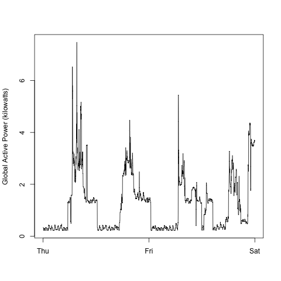
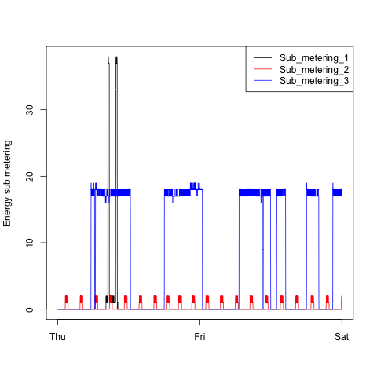
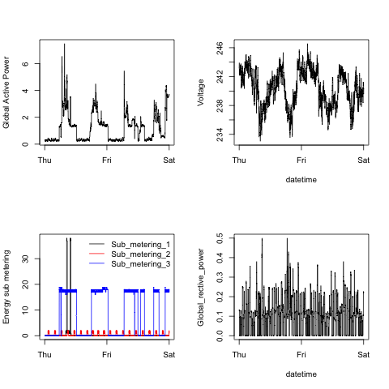

## Introduction

This is a fork of the repository found at
https://github.com/rdpeng/EXData_Plotting1

WARNING: I have inclded in my scripts a line that clears all of the data from
the R Environment. If you don't want to do this, please be sure to
comment out this line.

There are four scripts, creatively named "plot1.R", "plot2.R",
"plot3.R", and "plot4.R". Each script uses the base plotting functions
to generate the requested plots (also creatively named) "plot1.png",
"plot2.png", "plot3.png", and "plot4.png" found in the "figure"
sub-folder. As this repository was a fork of the instructors, the
original plots were included in the "figure" sub-folder. I elected to
let them remain for comparison. The files named
"unnamed-chunk-2.png", "unnamed-chunck-3.png", "unnamed-chunk-4.png",
and "unnamed-chunk-5.png" were not generated by me. They were
generated by the course instructor.

The plots that I created can be seen below:

### Plot 1

 

### Plot 2

 

### Plot 3

 

### Plot 4

 

